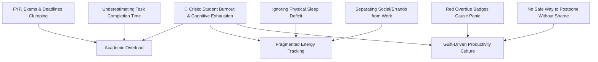
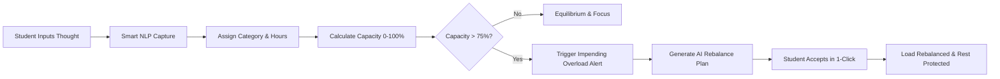
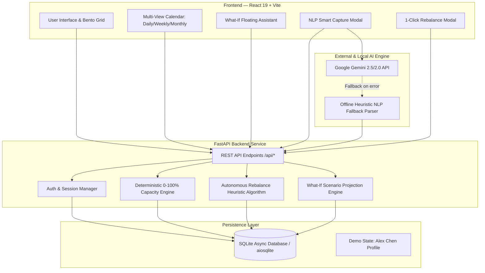

# 🌿 Lumora by Matcha & Coffee

> ### A Burnout Autopilot, Not Another To-Do List.
>
> *"Most productivity apps help students fit more into their schedules. Lumora helps them know when they shouldn't."*

[](https://itsocietymmu.com/codenection-2026/)
[](#-1-project-overview)
[](https://react.dev/)
[](https://vite.dev/)
[](https://tailwindcss.com/)
[](https://www.python.org/)
[](https://fastapi.tiangolo.com/)
[](https://ai.google.dev/)
[](https://sqlite.org/)

---

**Project Name**: Lumora  
**Team**: Nur Aleya Binti Muhammad Hafeez & Rina Syazana Binti Rahman  
**Problem Statement**: Stress & Workload Manager  
**Video Presentation**: [Unlisted YouTube Video Link](https://youtu.be/rTSTv5_J3HM?si=8cKCWk8ARzjgc5gi) *(Insert Video Link Here)*  
**Presentation Slides**: [Public Presentation Slides Link](https://canva.link/209ygsdv7ul2evl) *(Insert Slides Link Here)*  
**UI Prototype / Live Demo**: [https://lumora-autopilot.vercel.app/](https://lumora-autopilot.vercel.app/)  

---

## 📖 Table of Contents

- [1. Project Overview](#1-project-overview)
  - [1.1 The Problem](#11-the-problem)
  - [1.2 Our Solution](#12-our-solution)
  - [1.3 Core Feature Set](#13-core-feature-set)
- [2. Ideation & Process](#2-ideation--process)
  - [2.1 Ideas We Considered](#21-ideas-we-considered)
  - [2.2 Ideation Boards & Artifacts](#22-ideation-boards--artifacts)
  - [2.3 Mentor Consultation & Feedback Loop](#23-mentor-consultation--feedback-loop)
- [3. Design & Prototype](#3-design--prototype)
  - [3.1 Key User Interface Screens](#31-key-user-interface-screens)
  - [3.2 UX Design System & Calming Aesthetics](#32-ux-design-system--calming-aesthetics)
- [4. What Makes It Different](#4-what-makes-it-different)
  - [4.1 Novel Features & The Strategic Twist](#41-novel-features--the-strategic-twist)
  - [4.2 Competitive Comparison](#42-competitive-comparison)
- [5. Technical Architecture & Feasibility](#5-technical-architecture--feasibility)
  - [5.1 Technology Stack & Architectural Decisions](#51-technology-stack--architectural-decisions)
  - [5.2 System Architecture Diagram](#52-system-architecture-diagram)
  - [5.3 Build Plan & 3-Week Scope](#53-build-plan--3-week-scope)
- [6. Video Outline & Presentation Guide](#6-video-outline--presentation-guide)
- [7. Quick Start & Installation](#7-quick-start--installation)

---

## 1. Project Overview

### 1.1 The Problem
University students are experiencing record levels of chronic fatigue and cognitive burnout. In addition to rigorous academic obligations (Final Year Projects, laboratory assignments, quizzes), students juggle part-time jobs, internships, social relationships, daily household errands, and physical health maintenance.

#### Root Causes:
1. **Multi-Dimensional Cognitive Blindspot**: Academic, physical, emotional, and logistical demands compete for the same finite pool of human cognitive energy, but students track them across fragmented apps (or not at all).
2. **The "Efficiency Paradox" of Traditional Tools**: Conventional to-do lists and calendar optimizers treat human stamina as an infinite pipeline, encouraging users to pack every spare 15-minute slot.
3. **Overdue Shame and Punitive Feedback**: Missed deadlines in standard apps trigger alarming red countdowns and guilt-inducing alert badges, causing users to abandon the app precisely when they are most overwhelmed.

#### Stakeholders:
- **Primary**: Higher-education undergraduate and postgraduate students balancing heavy coursework with external life pressures.
- **Secondary**: Working students, academic advisors, university wellness counseling departments, and student organizations seeking healthy productivity benchmarks.

#### Existing Market Solutions & Shortfalls:
- **Todoist / TickTick**: Linear task checkers that celebrate cramming more tasks per day without modeling exhaustion or total weekly capacity constraints.
- **Notion**: Unstructured canvas requiring extensive manual maintenance and setup overhead, worsening student decision fatigue.
- **Motion / Reclaim AI**: Corporate-focused automatic schedulers that aggressively squeeze meetings and tasks into open calendar gaps rather than protecting rest buffers.
- **Forest / Pomodoro Apps**: Isolated timer tools that Gamify hyper-focus sessions without understanding the student's holistic weekly energy envelope.

---

### 1.2 Our Solution
**Lumora** is an intelligent **Burnout Autopilot** that protects university students from cognitive overload before burnout happens. 

Instead of asking students to cram more tasks into their day, Lumora continuously models their multi-dimensional cognitive load across Academic, Mood, Sleep, Social, and Errand demands. When impending overload is detected, Lumora's AI engine automatically formulates a personalized, non-destructive **Rebalance Plan** (safely postponing optional errands, resizing workouts, shielding deep-study blocks, and safeguarding recovery) with zero shame.

```
       CAPTURE               UNDERSTAND LOAD             DETECT OVERLOAD
 Natural Language NLP    →  Deterministic 0-100%   →   Impending Burnout Alert
  Intent Extraction           Capacity Engine             Threshold (>75%)
         ↓                           ↓                           ↓
      RECOVER                 AUTOPILOT REBALANCE            WHAT-IF SIMULATOR
 Restorative Sanctuary   ←   Move / Postpone / Shield   ←  Pre-Commitment Load
  Guilt-Free Downshift         1-Click Load Reduction       Delta Decision Support
```

---

### 1.3 Core Feature Set
- 🎙️ **Smart Natural Language Capture**: Converts conversational student thoughts (*"Need to finish my FYP methodology by Thursday, about 4 hours"*) into structured, categorized, auto-slotted commitments.
- ⚡ **Explainable Capacity Engine (0–100%)**: Computes real-time workload envelopes based on task complexity, sleep deficits, stress check-ins, and active commitments.
- 🛡️ **Autonomous Workload Rebalancer**: Generates 1-click rebalance proposals that safely shift non-essential tasks to next week, downscale workouts to active recovery, and protect high-stakes deadlines.
- 📅 **Integrated Multi-View Timeline Calendar**:
  - **Daily View**: Strict *Rule of 3* cognitive framing, category color-coded cards, and non-punitive *"Push to Tomorrow"* postponement.
  - **Weekly View**: 08 AM – 08 PM hourly visual timeline across 7 days.
  - **Monthly View**: 7x5 interactive calendar grid with task volume pills.
- 💬 **What-If Scenario Assistant**: Floating bottom-right assistant providing instant simulated load deltas before students accept new commitments.
- 🌿 **Recovery Sanctuary**: Prescriptive restorative protocols with interactive box breathing (4s inhale • 4s hold • 4s exhale) and restorative downshift timers.
- 📊 **Life Area Deep Dives**: Dedicated diagnostic pages for Academic & Focus, Mood & Stress, Physical & Sleep, and Social & Errands.

---

## 2. Ideation & Process

### 2.1 Ideas We Considered

| Idea | Status | Rationale: Why it was Kept or Dropped |
| :--- | :---: | :--- |
| **A. AI Workload Autopilot & Capacity Rebalancer (Final Solution)** | **Chosen** | **Kept.** Solves the fundamental root cause of student burnout by combining multi-dimensional load comprehension, automatic rebalancing proposals, and explicit guilt-free permission to rest. |
| **B. Multi-Dimensional Energy Envelope (Rule of 3 + Shielding)** | **Chosen** | **Kept.** Prevents cognitive paralysis by limiting daily focus to top 3 priorities while protecting high-focus academic deadlines from fragmentation. |
| **C. What-If Scenario Decision Assistant** | **Chosen** | **Kept.** Gives students foresight into the capacity impact of saying "yes" to new shifts, projects, or social commitments *before* committing. |
| **D. Simple Daily Stress / Mood Journal** | *Dropped* | *Dropped.* Passive reflection alone only tells students they are stressed without offering actionable schedule adjustments or workload remediation. |
| **E. AI Task Gamification with Daily Streaks & Penalties** | *Dropped* | *Dropped.* Strict streaks punish students when they fall ill or face emergencies, actively causing guilt and burnout rather than preventing it. |
| **F. Aggressive AI Auto-Scheduler (Corporate Calendar Packer)** | *Dropped* | *Dropped.* Filling every empty hour creates claustrophobic schedules; students require flexible buffer periods and psychological breathing room. |

---

### 2.2 Ideation Boards & Artifacts

#### A. Problem Tree & Root Cause Analysis

*Caption: Problem Tree highlighting how fragmented energy awareness and toxic productivity design lead to student collapse.*

#### B. 5 Whys Chain: Why Do Existing Apps Fail Students?
1. *Why do students feel overwhelmed using task managers?* $\rightarrow$ Because apps encourage adding infinite tasks without showing realistic total capacity.
2. *Why don't students know their capacity?* $\rightarrow$ Because apps only count task items, ignoring sleep deprivation, stress levels, and emotional fatigue.
3. *Why do schedules break during midterms?* $\rightarrow$ Because flexible errands and rigid study deadlines collide with zero buffer time.
4. *Why don't students reschedule earlier?* $\rightarrow$ Because rescheduling feels like failure, accompanied by overdue penalty badges.
5. *Why is Lumora needed?* $\rightarrow$ To act as an **autonomous autopilot** that calculates capacity, detects impending overload, and gives actionable, guilt-free rebalance solutions.

#### C. Autonomous User Flow

*Caption: End-to-end user loop from casual natural language capture to automatic proactive schedule rebalancing.*

---

### 2.3 Mentor Consultation & Feedback Loop

> **Mentoring Session Details:**
> - **Date & Time**: 9th September 2026, 11:30 AM (GMT+8)
> - **Platform**: Discord
> - **Mentor**: **Chua Zhu Heng**

During our dedicated consultation session, **Chua Zhu Heng** provided strategic guidance focusing on problem definition, compelling storytelling, UI/UX distinction, long-term user retention, and anti-cheating mechanisms. Below is how we transformed each core tip into concrete product architecture:

| Key Mentoring Guidance (Chua Zhu Heng) | Core Challenge Addressed | Actionable Solution & Architecture Implemented |
| :--- | :--- | :--- |
| **1. "Find a specific problem & target audience; create a tangible storyline using yourselves as the example."** | Grounding the problem in authentic student realities rather than generic task management. | • **Created the Alex Chen Persona**: Modeled after our own lived university struggles (balancing FYP thesis deadlines, lab quizzes, part-time work shifts, sleep deprivation, and daily errands).<br>• **7-Scene Demo Storyline**: Implemented a 1-click narrative sandbox (`Launch Live Demo`) taking judges through Alex's week: *Baseline (68%) $\rightarrow$ Smart Capture $\rightarrow$ Overload Crisis (91%) $\rightarrow$ 1-Click AI Rebalance $\rightarrow$ Recovery (73%) $\rightarrow$ What-If Forecasting* |
| **2. "After defining the problem, make an actionable solution to actively solve it, not just track it."** | Moving beyond passive dashboards to proactive, autonomous decision support. | • **Autonomous Workload Rebalance Engine**: Built the Rebalance Modal that algorithmically diagnoses load drivers and proposes 4 non-destructive actions (**MOVE** errands, **REDUCE** workout duration, **PROTECT** thesis focus blocks, **POSTPONE** social events) delivering an instant $\Delta -18\%$ capacity drop.<br>• **Pre-Commitment "What-If" Assistant**: Created the bottom-right floating chat drawer allowing students to forecast capacity impact before saying "yes" to new shifts or tasks. |
| **3. "Find innovative ways to impress judges with UI/UX. What is your visual and architectural uniqueness?"** | Standing out from clinical/corporate productivity tools with memorable, calming aesthetics. | • **Botanical Bento Design System**: Crafted a custom calming lime & forest palette (`#EBF7E9` canvas, `#1F6B4F` botanical green, `#152F26` deep evergreen) with soft **Aurora Light Glow Effects**.<br>• **Edge-to-Edge Responsive Bento Grid (`max-w-[1720px]`)**: Zero side gaps, fluid split-column layout with synchronized mini calendar and multi-view timeline.<br>• **Cognitive Rule of 3**: Automatically frames daily focus to top 3 essential items to guard attention. |
| **4. "How do you guarantee consistent retention and prevent users from cheating (just clicking 'done')?"** | Preventing app abandonment and eliminating artificial/dishonest completion habits. | • **Guilt-Free Retention ("Push to Tomorrow")**: Replaced punitive red overdue countdowns with positive reinforcement that rewards energy preservation.<br>• **Anti-Cheating Multi-Dimensional Telemetry**: Unlike traditional apps where users can "cheat" by mindlessly ticking boxes, Lumora weights capacity against **real-time sleep deficits (hrs)**, **perceived stress scores (1–5)**, and **cognitive fatigue**. Artificial checkbox ticking does not fix biological load imbalance.<br>• **Shielded Deep Work & Progress Bars**: Introduced granular progress tracking (`% done`) and shielded priority tags that protect high-stakes academic commitments. |

---

## 3. Design & Prototype

**UI Prototype / Web Application**: [https://lumora-autopilot.vercel.app/](https://lumora-autopilot.vercel.app/)  
*(Screenshots below showcase the live high-fidelity interface)*

### 3.1 Key User Interface Screens

#### 1. Landing Page — Welcoming & Purpose-Driven

*Caption: Clean, calming entrance showcasing the burnout autopilot value proposition, interactive preview, and one-click demo sandbox launcher.*

---

#### 2. Main Dashboard — Edge-to-Edge Bento Overview

*Caption: Responsive 6-column bento header featuring Hi Alex greeting with aurora glow, 4 life area metrics, combined capacity gauge, mini month calendar, and the multi-view timeline.*

---

#### 3. Smart NLP Task Capture — Conversational Thought Intake

*Caption: Natural language intake modal that automatically extracts title, category, estimated hours, deadline, and priority flags directly from raw student thoughts.*

---

#### 4. What-If Scenario Assistant (Collapsible Sidebar Chat)

*Caption: Collapsible right slide-over chat assistant enabling students to simulate pre-commitment capacity impact (e.g., accepting TA roles or shifting projects) with live risk analysis.*

---

#### 5. Daily View Timeline & Cognitive Guard

*Caption: Daily View enforcing the Rule of 3, category color-coded cards, progress over deadlines indicator, and non-punitive "Push to Tomorrow" action.*

---

#### 6. Mood & Stress Diagnostic Center

*Caption: Interactive check-in sliders for Perceived Stress, Mood Level, and Cognitive Fatigue paired with 7-day trend analytics.*

---

#### 7. Physical Health & Sleep Tracker

*Caption: Sleep duration tracker highlighting buffer deficits, restorative sleep targets, and energy-modulated physical workout commitments.*

---

#### 8. Social & Errands Harmonizer

*Caption: Management interface for flexible personal commitments that can be safely deprioritized when high-stakes academic deadlines converge.*

---

#### 9. Recovery Sanctuary — Prescribed Rest Protocols

*Caption: Safe restorative haven featuring interactive 4-4-4 box breathing pacing, ambient soundscapes, and customizable downshift timers with positive reinforcement.*

---

#### 10. All Tasks Hub & Universal Schedule Manager

*Caption: Unified repository supporting List, Kanban Board, and Timeline Calendar views with category filtering and instant task creation.*

---

#### 11. Student Onboarding & Sign-Up

*Caption: Frictionless authentication and baseline setup designed with gentle botanical aesthetic and immediate demo access.*

---

### 3.2 UX Design System & Calming Aesthetics
Lumora adheres to a strict design specification documented in [`docs/UI_UX_SPEC.md`](./docs/UI_UX_SPEC.md):
- **Botanical Canvas**: Serene lime green backdrop (`#EBF7E9`) and lush forest accents (`#1F6B4F`) replace sterile corporate white.
- **Aurora Light Gradients**: Soft luminous orbs behind hero containers provide depth without visual clutter.
- **Cognitive Typography**: High-contrast, clean sans-serif typography (`Plus Jakarta Sans`) paired with monospace numeric timestamps.

---

## 4. What Makes It Different

### 4.1 Novel Features & The Strategic Twist

```
               TRADITIONAL TASK MANAGERS                          LUMORA BURNOUT AUTOPILOT
      ┌────────────────────────────────────────┐          ┌────────────────────────────────────────┐
      │  • Goal: "How much more can I fit in?" │          │  • Goal: "When should I safely pause?" │
      │  • Linear to-do checkboxes             │    VS    │  • Multi-dimensional load envelope    │
      │  • Red overdue badges (Guilt & Shame)  │          │  • Guilt-Free "Push to Tomorrow"       │
      │  • Ignores sleep, stress & fatigue     │          │  • Sleep & stress-weighted capacity    │
      │  • Manual rescheduling headache        │          │  • 1-Click AI Autonomous Rebalance     │
      └────────────────────────────────────────┘          └────────────────────────────────────────┘
```

1. **The Capacity Engine (Multi-Dimensional Modeling)**: Unlike apps that simply sum task counts, Lumora models cognitive drag, time commitments, sleep debt, and stress into an explainable 0–100% capacity index.
2. **Autonomous Rebalance Proposals**: When overload is detected, Lumora doesn't just alert—it actively builds a non-destructive plan (moving groceries, downscaling workouts, shielding thesis study blocks).
3. **Guilt-Free UX Philosophy**: Eliminates punitive countdowns. Tasks feature positive completion bars and one-click non-penalized postponement.
4. **Pre-Commitment "What-If" Forecasting**: Enables students to simulate the exact workload impact of new commitments *before* accepting them.
5. **Rule of 3 Focus Protection**: Actively collapses low-priority clutter to protect working memory during high-stress periods.

---

### 4.2 Competitive Comparison

| Feature / Capability | Lumora | Todoist / TickTick | Notion | Motion / Reclaim | Forest / Pomodoro |
| :--- | :---: | :---: | :---: | :---: | :---: |
| **Autonomous Overload Detection** | ✅ **Yes (0-100% Index)** | ❌ No | ❌ No | ⚠️ Partial (Calendar only) | ❌ No |
| **Multi-Dimensional Load (Sleep + Stress + Life)** | ✅ **Yes** | ❌ Tasks only | ❌ Manual setup | ❌ Calendar only | ❌ Timers only |
| **1-Click AI Workload Rebalance** | ✅ **Yes** | ❌ Manual move | ❌ Manual move | ⚠️ Auto-crams calendar | ❌ No |
| **What-If Decision Simulator** | ✅ **Yes (Interactive)** | ❌ No | ❌ No | ❌ No | ❌ No |
| **Guilt-Free Rescheduling ("Push to Tomorrow")** | ✅ **Yes (Positive)** | ❌ Overdue Red | ❌ No feedback | ❌ Reschedules silently | ❌ Fails tree |
| **Rule of 3 Cognitive Guard** | ✅ **Yes (Enforced)** | ❌ Infinite list | ❌ Custom setup | ❌ Full schedule | ❌ Single session |
| **Built-In Restorative Recovery Sanctuary** | ✅ **Yes (Box Breathing)** | ❌ No | ❌ No | ❌ No | ⚠️ Rest timer |

---

## 5. Technical Architecture & Feasibility

### 5.1 Technology Stack & Architectural Decisions

| Layer | Technology | Rationale & Why It Was Chosen | Expected Constraints & Mitigations |
| :--- | :--- | :--- | :--- |
| **Frontend UI** | **React 19 + Vite 8** | High-speed rendering, state management, and modern component architecture with sub-second hot reloading. | *Bundle size*: Optimized with dynamic modular imports and Tailwind CSS utility tree-shaking. |
| **Styling & Icons** | **Tailwind CSS v4 + Lucide Icons** | Zero-runtime CSS engine providing rapid prototyping of the custom botanical design system and accessible icons. | *Version migration*: Utilized v4 theme variables for consistent CSS token propagation. |
| **Data Viz & Effects**| **Recharts + Canvas Confetti** | Smooth SVG-based rendering for 7-day stress trends and lightweight particle celebrations. | *Mobile canvas sizing*: Wrapped charts in `ResponsiveContainer` for fluid scaling. |
| **Backend API** | **FastAPI (Python 3.13)** | Asynchronous high-performance REST API with automatic OpenAPI documentation and strict Pydantic type validation. | *Async concurrency*: Managed using `asyncio` and async SQLite drivers to prevent thread blocking. |
| **Database** | **SQLite via `aiosqlite`** | Frictionless, zero-setup async relational database pre-seeded with Alex Chen demo state. Fully compatible with PostgreSQL/Supabase. | *Concurrency limit*: Suitable for single-node; seamless migration path to cloud PostgreSQL via SQLModel/SQLAlchemy. |
| **AI NLP Engine** | **Google Gemini API + Heuristic Fallback** | Advanced natural language intent extraction for Smart Capture and conversational scenario analysis. | *API Rate Limits / Offline*: Implemented deterministic regex/heuristic fallback parser for 100% offline resilience. |

---

### 5.2 System Architecture Diagram



---

### 5.3 Build Plan & 3-Week Scope

The project scope was intentionally structured to ensure high technical depth, rigorous UX execution, and realistic feasibility:

```
┌────────────────────────────────────────────────────────────────────────────────────────┐
│                                   3-WEEK BUILD PLAN                                    │
├─────────────────────────┬───────────────────────────────┬──────────────────────────────┤
│   WEEK 1: CORE FOUNDATION│   WEEK 2: AUTOPILOT ENGINE    │   WEEK 3: POLISH & SIMULATION│
├─────────────────────────┼───────────────────────────────┼──────────────────────────────┤
│ • SQLite Schema & Auth   │ • Multi-Dimensional Capacity  │ • What-If Scenario Assistant │
│ • FastAPI Backend Setup │   Engine (0-100% algorithm)   │   (Floating Sidebar Chat)    │
│ • Natural Language Smart│ • 1-Click Rebalance Generator │ • Recovery Sanctuary & Box   │
│   Capture (Gemini API + │ • Multi-View Timeline Calendar│   Breathing Animation Widget │
│   Offline NLP Fallback) │   (Daily, Weekly, Monthly)    │ • End-to-End User Testing    │
│ • Initial Bento UI Grid │ • Guilt-Free Postpone Action  │ • Documentation & UI Spec    │
└─────────────────────────┴───────────────────────────────┴──────────────────────────────┘
```

---

## 6. Video Outline & Presentation Guide

**Target Duration**: 4 minutes 30 seconds (Max 5:00)  
**Platform**: YouTube (Unlisted)  
**Slide Deck**: [Public Slides Link](https://canva.link/209ygsdv7ul2evl) *(Insert Slides Link Here)*

### Recommended Video Flow:
1. **0:00 – 0:45 | The Hook & The Problem**
   - The hidden epidemic of student burnout: juggling FYPs, quizzes, part-time jobs, and sleep deficits.
   - Why existing to-do apps make the problem worse (efficiency paradox & overdue shame).
2. **0:45 – 1:30 | Solution Overview & What's Different**
   - Introduce **Lumora**: A burnout autopilot, not another to-do list.
   - Explain the 0–100% Explainable Capacity Envelope and the core autonomous loop.
3. **1:30 – 3:30 | End-to-End Prototype Walkthrough (Alex Chen Demo)**
   - **Smart Capture**: Natural language task entry with auto-categorization.
   - **Overload Detection**: Capacity jumps to 91% ("High Overload Risk").
   - **1-Click AI Rebalancer**: Showing non-destructive changes (Move, Reduce, Protect, Postpone) $\rightarrow$ Capacity drops to 73% with celebration!
   - **Multi-View Calendar**: Daily Rule of 3, Guilt-Free "Push to Tomorrow", and weekly timeline.
   - **What-If Assistant**: Simulating a 10hr/week TA job in real-time from the floating chat drawer.
   - **Recovery Sanctuary**: Box breathing session and restorative timer.
4. **3:30 – 4:15 | Technical Architecture & Feasibility**
   - React 19 + FastAPI + Gemini API + SQLite stack.
   - Offline fallback parser and 3-week execution plan.
5. **4:15 – 4:30 | Impact & Conclusion**
   - Transforming student mental health from chronic exhaustion to sustainable equilibrium.

---

## 7. Quick Start & Installation

### Prerequisites
- **Node.js**: v18.0 or higher
- **Python**: v3.11 or higher

### Option 1: One-Click Launch (Windows)
Double-click `start_lumora.bat` in the root folder to start both servers automatically.

### Option 2: Manual Terminal Startup

```bash
# 1. Clone the repository
git clone https://github.com/yuusenbe/Lumora.git
cd Lumora

# 2. Start Backend Server
python backend_server.py
# Backend runs at https://lumora-autopilot.vercel.app/

# 3. In a new terminal, start Frontend
cd frontend
npm install
npm run dev
# Frontend runs at https://lumora-autopilot.vercel.app/
```

Open your browser at **`https://lumora-autopilot.vercel.app/`** and click **"Launch Live Demo"** to explore as Alex Chen!

---

<div align="center">
  <sub>Built with care for <b>CodeNection 2026</b> by <b>Nur Aleya & Rina Syazana</b>. Protect your energy. 🌿</sub>
</div>

