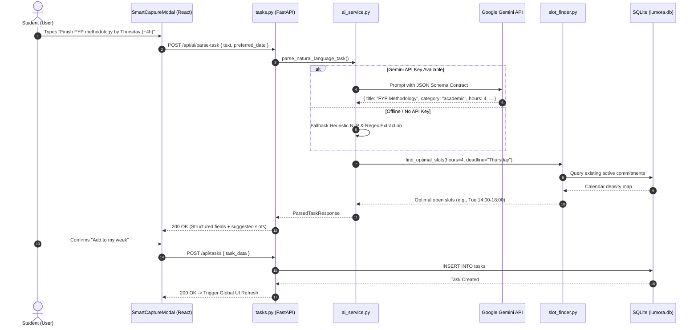
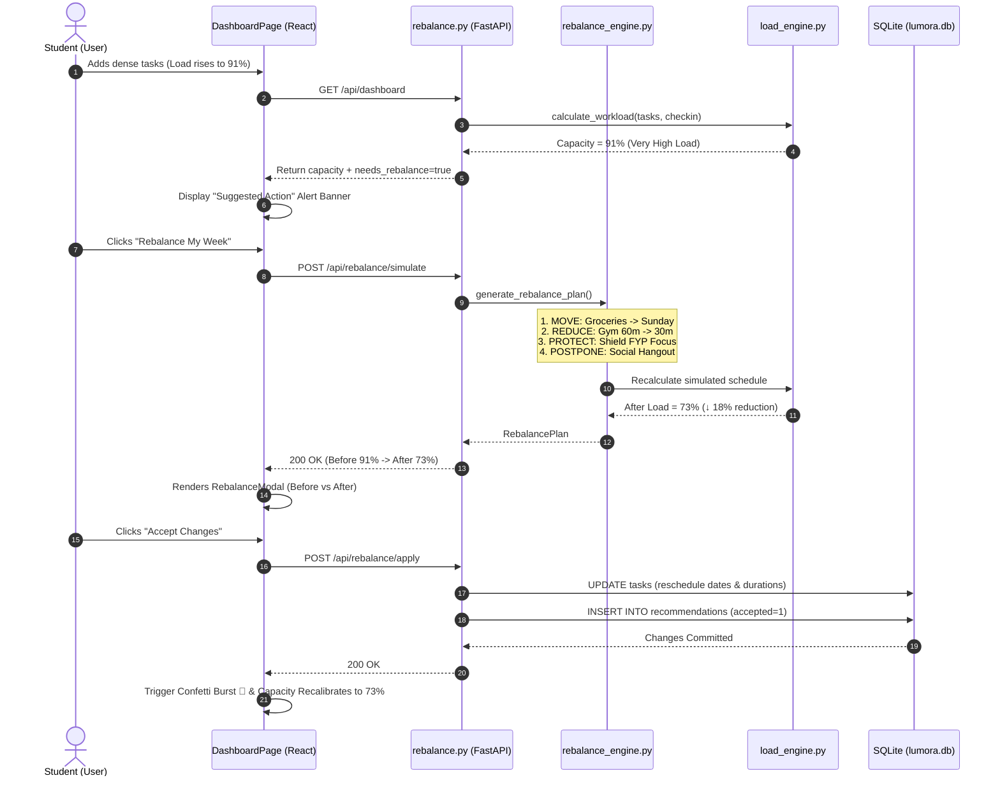
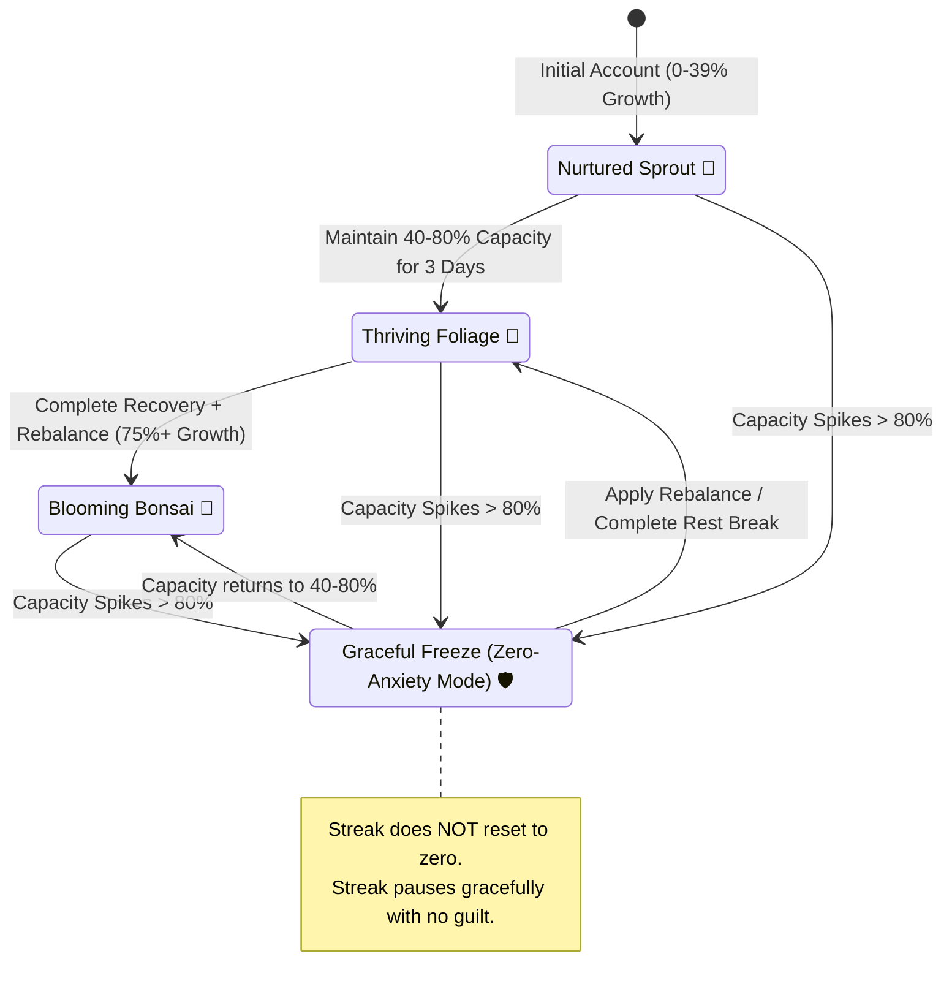
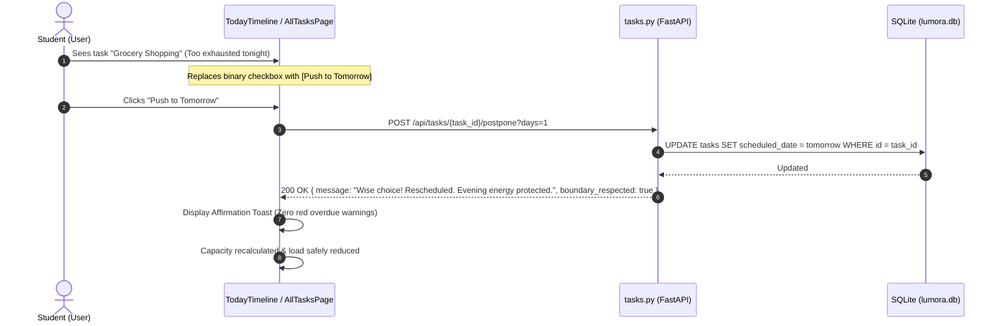

# Lumora — System Architecture & Technical Blueprint

## 1. System Overview

**Lumora** is architected as a modern, decoupled client-server web application. It combines a high-performance Python backend (FastAPI) with a responsive, low-stress Single Page Application (SPA) frontend (React 19, Vite, and Tailwind CSS v4).

Unlike traditional task managers that solely aggregate to-do lists, Lumora incorporates an **Explainable Capacity & Burnout Autopilot Engine**. The system employs a **hybrid AI design**:
1. **Deterministic Rule Engines** calculate objective numerical metrics (Workload Capacity 0–100%, Category Load Breakdowns, Rebalancing Deltas).
2. **Generative Language Models (LLMs)** and NLP Heuristics handle unstructured input extraction (Smart Capture), contextual workload explanations, and personalized recovery guidance.

---

## 2. End-to-End System Container Architecture (C4 Model)

```mermaid
flowchart TB
    subgraph ClientTier ["Client Tier (Browser SPA)"]
        UI["React 19 + Tailwind CSS v4 SPA"]
        Context["AuthContext & Global UI State"]
        APIClient["client.js (Fetch + Token Injection)"]
        UI --> Context
        Context --> APIClient
    end

    subgraph APITier ["API Gateway & Controller Tier (FastAPI)"]
        Router["FastAPI REST Router (/api)"]
        Pydantic["Pydantic v2 Schema Validators"]
        CORS["CORS & Auth Middleware"]
        Router --> Pydantic
        Router --> CORS
    end

    subgraph LogicTier ["Intelligence & Autopilot Core"]
        LoadEngine["Load Engine (Deterministic 0-100%)"]
        RebalanceEngine["Rebalance Engine (Move, Reduce, Protect, Postpone)"]
        SanctuaryService["Sanctuary Service (Anti-Streak & Living Plant)"]
        SlotFinder["Slot Finder Engine (Clash-Free Allocator)"]
        AIService["AI Service (Gemini API & NLP Heuristic Parser)"]
    end

    subgraph DataTier ["Persistence Layer"]
        DBConn["aiosqlite Async Connection Pool"]
        SQLiteDB[("lumora.db (SQLite / PostgreSQL Ready)")]
        DBConn --> SQLiteDB
    end

    APIClient -->|HTTP / JSON + Bearer Token| Router
    Router --> LogicTier
    LogicTier --> DBConn
    AIService -.->|External API Call (Optional)| GoogleGemini["Google Gemini LLM API"]
```

---

## 3. Complete Directory Structure

```text
Lumora/
├── backend/                             # Python FastAPI Backend
│   ├── api/                             # REST API Route Controllers
│   │   ├── auth.py                      # Authentication, Signup, & Demo Login
│   │   ├── checkins.py                  # Mood, Stress, Sleep & Fatigue tracking
│   │   ├── dashboard.py                 # Aggregated overview & capacity data
│   │   ├── rebalance.py                 # Schedule rebalancing & demo triggers
│   │   ├── recovery.py                  # Recovery recommendations & Sanctuary
│   │   ├── tasks.py                     # CRUD, AI parsing, slot finding, snooze
│   │   └── whatif.py                    # Decision impact simulation endpoint
│   ├── database/                        # Database Layer & Migrations
│   │   ├── connection.py                # aiosqlite async database pool & schema init
│   │   └── seed_data.py                 # Realistic demo data (Alex Chen profile)
│   ├── models/                          # Data Models & Schemas
│   │   └── schemas.py                   # Pydantic v2 Request/Response contracts
│   ├── services/                        # Business Logic & Intelligence Engines
│   │   ├── ai_service.py                # Gemini API integration & NLP fallback
│   │   ├── burnout_engine.py            # Early overload & strain detection rules
│   │   ├── load_engine.py               # Deterministic 0-100% capacity calculation
│   │   ├── rebalance_engine.py          # Schedule optimization (Move, Reduce, Protect)
│   │   ├── recovery_engine.py           # Restorative opportunity generator
│   │   ├── sanctuary_service.py         # Anti-Streak & living plant growth tracker
│   │   └── slot_finder.py               # Clash-free intelligent calendar placement
│   ├── test_scenario.py                 # End-to-end backend automated test suite
│   ├── lumora.db                        # SQLite local database storage
│   ├── main.py                          # FastAPI app entry point & middleware config
│   └── requirements.txt                 # Python backend dependencies
├── docs/                                # Project Specifications & Blueprint Documentation
│   ├── ARCHITECTURE.md                  # System architecture & component blueprints
│   ├── REQUIREMENTS.md                  # PRD, functional epics & non-functional criteria
│   ├── SETUP_GUIDE.md                   # Local setup, installation & troubleshooting matrix
│   ├── API_DOCUMENTATION.md             # REST API specifications, schemas & cURL examples
│   ├── UI_UX_SPEC.md                    # Calming visual aesthetics, UI components & user flows
│   └── DATABASE.md                      # Database architecture, schema models & data dictionary
├── frontend/                            # React 19 Frontend Application
│   ├── public/                          # Static assets, branding symbols & icons
│   │   ├── favicon.ico
│   │   └── logo_symbol_transparent.png
│   ├── src/                             # Source code
│   │   ├── api/                         # Backend communication layer
│   │   │   └── client.js                # Fetch client with token injection & error mapping
│   │   ├── components/                  # Reusable UI Components
│   │   │   ├── BalanceSanctuary.jsx     # Anti-Streak, living plant & equilibrium card
│   │   │   ├── CalendarView.jsx         # Interactive multi-category calendar
│   │   │   ├── CapacityCard.jsx         # Hero 0-100% capacity gauge & rebalance trigger
│   │   │   ├── CategoryCard.jsx         # Modular life area breakdown card
│   │   │   ├── LoadBreakdown.jsx        # Visual category load contribution bars
│   │   │   ├── Navbar.jsx               # Navigation bar with live capacity & streak pills
│   │   │   ├── RebalanceModal.jsx       # Before/after comparison rebalancing modal
│   │   │   ├── SmartCaptureModal.jsx    # Natural language task creation dialog
│   │   │   ├── TaskEditModal.jsx        # Granular task editor dialog
│   │   │   └── TodayTimeline.jsx        # Rule of 3 daily timeline & snooze controls
│   │   ├── context/                     # Global State Management
│   │   │   └── AuthContext.jsx          # Auth session, view routing, & refresh triggers
│   │   ├── pages/                       # Application Views
│   │   │   ├── AcademicPage.jsx         # FYP, assignments, study load management
│   │   │   ├── AllTasksPage.jsx         # Full schedule list & calendar view
│   │   │   ├── DashboardPage.jsx        # Main overview dashboard
│   │   │   ├── LandingPage.jsx          # Public product landing page
│   │   │   ├── LoginPage.jsx            # User sign-in
│   │   │   ├── MoodPage.jsx             # Stress/mood check-in & 7-day trend chart
│   │   │   ├── PhysicalPage.jsx         # Sleep hours, workout debt, & physical load
│   │   │   ├── RecoveryPage.jsx         # Sanctuary mode, breathwork & audio timers
│   │   │   ├── SignupPage.jsx           # User registration
│   │   │   ├── SocialErrandsPage.jsx    # Errands, chores, & social battery tracking
│   │   │   └── WhatIfPage.jsx           # Decision simulator for new commitments
│   │   ├── App.css                      # Custom theme overrides & keyframe animations
│   │   ├── App.jsx                      # Main route orchestrator
│   │   ├── index.css                    # Tailwind CSS v4 base directives & fonts
│   │   └── main.jsx                     # React root DOM mount
│   ├── package.json                     # Frontend scripts & NPM dependencies
│   └── vite.config.js                   # Vite 8 bundler configuration & proxy routes
├── backend_server.py                    # Python development runner script
├── start_lumora.bat                     # Windows one-click dual launch script
└── README.md                            # High-level overview & quickstart guide
```

---

## 4. Workload Engine Mathematical Formulation

The capacity engine calculates cumulative burden as a deterministic linear combination with recovery offsets:

$$\text{Capacity Score } (C) = \min\left(100, \max\left(0, \sum L_{\text{categories}} - R_{\text{credits}}\right)\right)$$

Where:
1. **Academic Time Load ($L_{\text{acad}}$)**:
   $$L_{\text{acad}} = \sum_{t \in \text{Tasks}} (\text{hours}_t \times w_{\text{priority}}) \quad \text{where } w_{\text{high}}=1.4, w_{\text{med}}=1.0, w_{\text{low}}=0.7$$
2. **Cognitive & Mental Load ($L_{\text{mental}}$)**:
   $$L_{\text{mental}} = (\text{Stress Level} \times 4.0) + (\text{Mental Fatigue} \times 3.5)$$
3. **Physical Load ($L_{\text{phys}}$)**:
   $$L_{\text{phys}} = \max\left(0, (7.5 - \text{Sleep Hours}) \times 4.5\right) + \sum (\text{Workout Hours} \times 3.0)$$
4. **Social & Errand Load ($L_{\text{social}}, L_{\text{errand}}$)**:
   Weighted by flexibility and proximity to high-density academic deadlines.
5. **Recovery Credit Offset ($R_{\text{credits}}$)**:
   - Applied Rebalancing Plan: $-6.0$ to $-18.0\text{ pts}$
   - Active Recovery Completion: $-4.0\text{ pts}$

---

## 5. End-to-End Sequence Diagrams

### 5.1 Smart Capture & Natural Language Parsing Pipeline



---

### 5.2 Overload Detection & Autonomous Rebalance Loop



---

### 5.3 Anti-Streak & Living Plant Equilibrium State Machine



---

### 5.4 Guilt-Free Postponing (Anti-Fake Ticking Pipeline)



---

## 6. AI & ML Integration Architecture

Lumora enforces an **Explainable AI** paradigm. Machine learning models are strictly prohibited from generating arbitrary numerical capacity scores.

| Domain | Mechanism | Role |
|---|---|---|
| **Numerical Load Scoring** | Deterministic Equation Engine | Computes exact mathematical weights, ensuring 100% explainability and transparency. |
| **Natural Language Parsing** | Gemini API (`google-genai`) | Extracts structured task attributes from conversational input. |
| **Offline Resilience** | Heuristic Regex/NLP Parser | Fallback parser ensuring offline functionality when API keys are absent. |
| **Load Explanation** | LLM Prompt Template | Translates numeric vector deltas into compassionate, non-clinical explanations. |
| **Decision Simulation** | Heuristic Rule Classifier | Simulates trade-offs for hypothetical commitments in the What-If Engine. |

---

## 7. External Service Integrations

- **Google Gemini API**: Utilizes `google-genai` SDK with JSON structured output formatting (`response_mime_type="application/json"`).
- **PostgreSQL / Supabase Compatibility**: Built using standard SQL schemas enabling seamless transitions from `aiosqlite` to remote PostgreSQL instances by updating `DATABASE_URL`.
- **Calendar Integration**: Structured schedule attributes (`scheduled_date`, `scheduled_start`, `scheduled_end`) are pre-formatted for standard iCalendar (`.ics`) and Google Calendar export.
