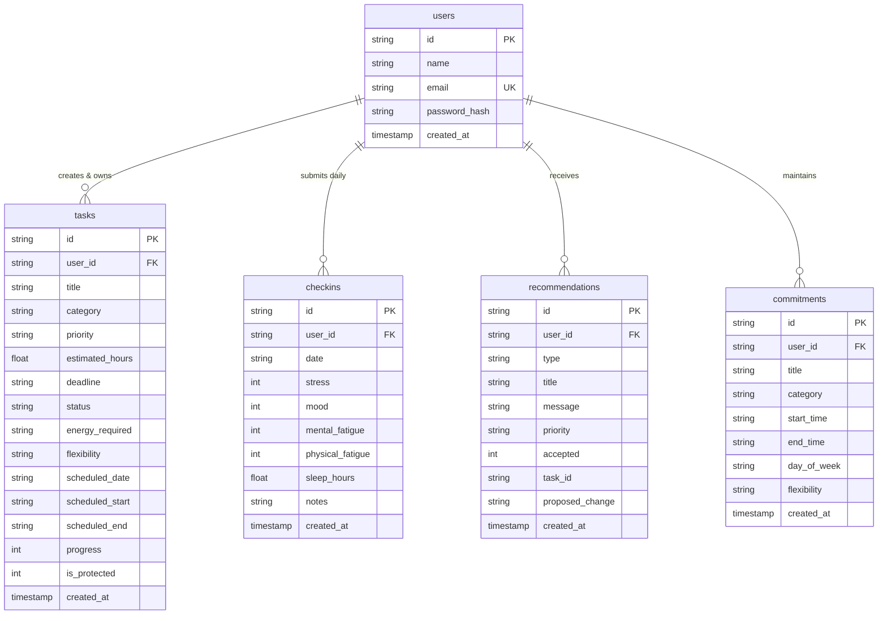

# Lumora — Database Architecture & Data Dictionary

## 1. Database Architecture

Lumora uses an asynchronous **SQLite** engine managed via `aiosqlite`. 

- **Storage File**: `backend/lumora.db`
- **Design Strategy**: Uses strict foreign key constraints, ISO-8601 string dates (`YYYY-MM-DD`), and standard SQL data types.
- **Production Portability**: 100% compatible with **PostgreSQL / Supabase** by redirecting the connection string.

---

## 2. Data Dictionary

### 2.1 Table: `users`
Stores student accounts and authentication credentials.

| Column | Type | Constraints | Default | Description |
|---|---|---|---|---|
| `id` | `TEXT` | `PRIMARY KEY` | — | Unique user identifier (e.g. `demo-alex-student-001`). |
| `name` | `TEXT` | `NOT NULL` | — | Student display name. |
| `email` | `TEXT` | `UNIQUE, NOT NULL` | — | Unique login email. |
| `password_hash` | `TEXT` | `NOT NULL` | — | Securely hashed password. |
| `created_at` | `TIMESTAMP` | — | `CURRENT_TIMESTAMP` | Account creation timestamp. |

---

### 2.2 Table: `tasks`
Stores scheduled tasks, assignments, jobs, workouts, and errands.

| Column | Type | Constraints | Default | Description |
|---|---|---|---|---|
| `id` | `TEXT` | `PRIMARY KEY` | — | Unique task ID (e.g. `task-01`). |
| `user_id` | `TEXT` | `FOREIGN KEY (users.id)` | — | Associated student ID. |
| `title` | `TEXT` | `NOT NULL` | — | Task title or subject. |
| `category` | `TEXT` | `NOT NULL` | `'academic'` | Category: `academic`, `work`, `physical`, `social`, `errand`. |
| `priority` | `TEXT` | `NOT NULL` | `'medium'` | Priority level: `low`, `medium`, `high`. |
| `estimated_hours` | `REAL` | `NOT NULL` | `2.0` | Estimated duration in hours. |
| `deadline` | `TEXT` | — | `NULL` | Explicit deadline string or date. |
| `status` | `TEXT` | — | `'pending'` | Task state: `pending`, `completed`, `postponed`. |
| `energy_required` | `TEXT` | — | `'medium'` | Energy expenditure: `low`, `medium`, `high`. |
| `flexibility` | `TEXT` | — | `'medium'` | Rebalance flexibility: `low`, `medium`, `high`. |
| `scheduled_date` | `TEXT` | — | `NULL` | Assigned date (`YYYY-MM-DD`). |
| `scheduled_start` | `TEXT` | — | `NULL` | Scheduled start time (`HH:MM`). |
| `scheduled_end` | `TEXT` | — | `NULL` | Scheduled end time (`HH:MM`). |
| `progress` | `INTEGER` | — | `0` | Completion percentage ($0–100$). |
| `is_protected` | `INTEGER` | — | `0` | Flag ($1 = \text{true}$) shielding task from interruptions. |
| `created_at` | `TIMESTAMP` | — | `CURRENT_TIMESTAMP` | Creation timestamp. |

---

### 2.3 Table: `checkins`
Stores daily self-reported bandwidth, mood, and sleep metrics.

| Column | Type | Constraints | Default | Description |
|---|---|---|---|---|
| `id` | `TEXT` | `PRIMARY KEY` | — | Unique check-in ID. |
| `user_id` | `TEXT` | `FOREIGN KEY (users.id)` | — | Associated student ID. |
| `date` | `TEXT` | `NOT NULL` | — | Check-in date (`YYYY-MM-DD`). |
| `stress` | `INTEGER` | `NOT NULL` | `3` | Perceived stress scale ($1–5$). |
| `mood` | `INTEGER` | `NOT NULL` | `3` | Mood bandwidth scale ($1–5$). |
| `mental_fatigue` | `INTEGER` | `NOT NULL` | `3` | Cognitive saturation ($1–5$). |
| `physical_fatigue`| `INTEGER` | `NOT NULL` | `3` | Physical exhaustion ($1–5$). |
| `sleep_hours` | `REAL` | `NOT NULL` | `7.0` | Hours of sleep recorded ($0–24$). |
| `notes` | `TEXT` | — | `NULL` | Optional student reflection text. |
| `created_at` | `TIMESTAMP` | — | `CURRENT_TIMESTAMP` | Submission timestamp. |

---

### 2.4 Table: `recommendations`
Stores AI rebalance actions and user acceptance states.

| Column | Type | Constraints | Default | Description |
|---|---|---|---|---|
| `id` | `TEXT` | `PRIMARY KEY` | — | Unique recommendation ID. |
| `user_id` | `TEXT` | `FOREIGN KEY (users.id)` | — | Associated student ID. |
| `type` | `TEXT` | `NOT NULL` | — | Action type: `move`, `reduce`, `protect`, `postpone`. |
| `title` | `TEXT` | `NOT NULL` | — | Recommendation headline. |
| `message` | `TEXT` | `NOT NULL` | — | Plain-language rationale. |
| `priority` | `TEXT` | — | `'medium'` | Recommendation urgency. |
| `accepted` | `INTEGER` | — | `NULL` | $1 = \text{accepted}$, $0 = \text{declined}$, $\text{NULL} = \text{pending}$. |
| `task_id` | `TEXT` | — | `NULL` | Target task ID modified. |
| `proposed_change`| `TEXT` | — | `NULL` | JSON string describing schedule modifications. |
| `created_at` | `TIMESTAMP` | — | `CURRENT_TIMESTAMP` | Generation timestamp. |

---

## 3. Database Initialization & Seeding

The SQLite database is initialized and seeded automatically upon backend startup:

1. **Schema Initialization (`backend/database/connection.py`)**:
   `init_db()` executes `CREATE TABLE IF NOT EXISTS` for all entities.
2. **Demo Profile Seeding (`backend/database/seed_data.py`)**:
   Populates **Alex Chen** with 7 commitments (FYP methodology, software lab, part-time shifts, gym, groceries, and social sync).
