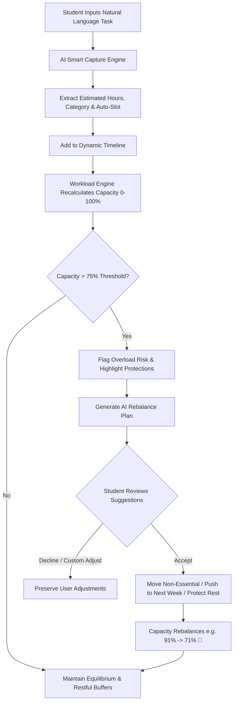

# Lumora — UI/UX Design System & Specification

## 1. Design Philosophy & Low-Stress Aesthetics

Lumora adheres to a **calming, non-punitive, cognitive-protective visual philosophy**. The user interface communicates psychological safety, energy preservation, and clear mental bandwidth rather than urgency and pressure.

```
       LUSH BOTANICAL         DEEP EVERGREEN         SERENE LIME            MINT AURORA
          #1F6B4F                #152F26               #EBF7E9                #86EFAC
      (Primary Accent)       (High Contrast Dark)   (Global Canvas)        (Aura Glow Light)

       CELESTIAL SKY          WARM SUN AURA          SOFT SAGE BORDER       TEXT SLATE
          #38BDF8                #FACC15               #D2E2D8                #638379
      (Aura Accent 2)        (Aura Accent 3)        (Dividers & Cards)     (Subtitles & Meta)
```

### Category Color Matrix:
| Category | Primary Color | Card Background | Card Border | Progress Bar | Badge / Tag |
| :--- | :--- | :--- | :--- | :--- | :--- |
| **Academic** | `#2B6CB0` (Slate Blue) | `#F0F7FF` | `#BFDBFE` | `bg-[#2B6CB0]` | Blue Pill |
| **Work** | `#705898` (Lavender Purple) | `#F8F5FC` | `#DDD6FE` | `bg-[#705898]` | Violet Pill |
| **Physical & Sleep** | `#1F6B4F` (Emerald Green) | `#F0F9F4` | `#C2E2D0` | `bg-[#1F6B4F]` | Mint Pill |
| **Mood & Stress** | `#705898` (Muted Violet) | `#F3EFF9` | `#DDD6FE` | `bg-[#705898]` | Lavender Pill |
| **Social & Errands** | `#B85D6F` (Berry Rose) | `#FFF1F3` | `#FECDD3` | `bg-[#B85D6F]` | Rose Pill |
| **Errands** | `#D97706` (Golden Amber) | `#FEFCE8` | `#FDE68A` | `bg-[#D97706]` | Amber Pill |

---

### Core Low-Stress UX Rules:
1. **The Rule of 3 (Cognitive Guard)**:
   - The Daily View prioritizes the top 3 focus items for the active day to prevent decision fatigue.
   - Additional scheduled items are safely collapsed under *"View All"* / *"+ N more scheduled responsibilities hidden to protect focus"*.
2. **Progress Over Deadlines**:
   - Tasks emphasize percentage completion bars (`% done`) instead of aggressive red countdown timers.
3. **Guilt-Free Postponement ("Push to Tomorrow")**:
   - One-click non-punitive rescheduling with positive affirmative feedback (*"Moved to tomorrow. Energy preserved!"*).
   - No overdue penalties or shame badges.
4. **Aurora Visual Energy & Edge-to-Edge Bento Architecture**:
   - Fluid `max-w-[1720px]` responsive bento layout with no awkward margins or wasted horizontal space.
   - Soft glowing aura background effects behind primary action cards for depth and visual warmth.
5. **Non-Clinical, Compassionate Language**:
   - The system presents observations as cognitive bandwidth and energy envelopes (e.g., *"Your load appears high (71% capacity)"*), strictly avoiding medicalized diagnostic labels.

---

## 2. Component & Layout Specifications

### 2.1 Top Bento Row (6-Column Edge-to-Edge Header)
The top header provides an instantaneous overview of energy, life areas, and capacity:

1. **Container 1: Hi Alex Greeting & Smart Capture**
   - Background: Botanical green gradient (`#185A41` $\rightarrow$ `#1F6B4F`) with soft aurora glow orbs (`#86EFAC`, `#38BDF8`, `#FACC15`).
   - Title: `Hi Alex 👋` with subtitle *"Real-time cognitive energy envelope."*
   - Action: High-contrast white **"Capture Task"** button opening natural language NLP capture modal.

2. **Container 2: Academic**
   - Background: Soft Ice Blue (`#EBF4FB`), Border: `#BFDBFE`.
   - Metric: Dynamic load percentage (e.g. `42% load`) with subtitle (*FYP thesis, quiz, labs*).

3. **Container 3: Mood & Stress**
   - Background: Soft Lavender (`#F3EFF9`), Border: `#DDD6FE`.
   - Metric: Perceived stress score (e.g. `Level 3/5`) with stability badge.

4. **Container 4: Physical & Sleep**
   - Background: Soft Mint (`#E3F2E9`), Border: `#C2E2D0`.
   - Metric: Sleep tracking duration (e.g. `6.8 hrs`) with deficit/optimal status chip.

5. **Container 5: Social & Errands**
   - Background: Soft Rose (`#FCEEF0`), Border: `#FECDD3`.
   - Metric: Aggregate social & errands percentage (e.g. `20% load`) with flexible badge.

6. **Container 6: Capacity Percentage & Rebalance**
   - Background: Matching Botanical green gradient with aurora glow.
   - Metric: Large numeric percentage (e.g. `71% Capacity`) and live load status badge.
   - Action: High-contrast white **"Rebalance My Week"** button.
   - Interaction: Clicking card opens the **Life Load Breakdown Modal** with granular category breakdown and hours allocation.

---

### 2.2 Main Dashboard Grid (Split Bento Layout)

#### Left Column (~38% Width):
- **Mini Month Calendar (`MiniMonthCalendar`)**:
  - Interactive compact month grid with previous/next month navigation and "Today" button.
  - Category dot indicators on dates with scheduled tasks.
  - Highlighting for today (`#1F6B4F`) and active selected date ring.
- **Upcoming Focus Card**:
  - High-contrast card (`#152F26` / `#1F6B4F`) highlighting the next pending commitment.
  - Time badge, duration indicator, shielded badge, and quick complete action.
- **Demo Controls Toolbar**:
  - Evaluation controls for live demonstrations (`Simulate 91% Overload` and `Reset to Monday Baseline`).

#### Right Column (~62% Width):
- **Multi-View Timeline Calendar (`WeeklyTimelineCalendar`)**:
  - **Header Controls**: Date range / month title display, Previous / Next arrows, Today jump button, and 3-way view switcher (`Daily` | `Weekly` | `Monthly`).
  - **Daily View**:
    - Focus date header with "Rule of 3" chip.
    - Category-colored task cards with matching background tints, borders, category badges, and progress bar fills.
    - Non-punitive **"Push to Tomorrow"** postponement button.
    - Confetti celebration on task completion.
  - **Weekly View**:
    - 7-Day column headers (Mon–Sun) with date numerals and active selection highlights.
    - 08 AM – 08 PM hourly timeline rows.
    - Category-themed scheduled task blocks with time intervals, title, and shielded badges.
    - Direct click-to-schedule empty slot interactions.
  - **Monthly View**:
    - Full 7x5 month grid displaying task count pills and category markers.
    - Clicking any date instantly selects the date and transitions to focused Daily View.

---

### 2.3 What-If Decision Assistant & Collapsible Sidebar Chat (`WhatIfSidebarChat`)
- **Desktop Experience**:
  - Floating trigger button fixed at the bottom-right viewport (`fixed bottom-6 right-6 z-40`) featuring glowing sparkle indicator and tooltip.
  - Clicking triggers a smooth slide-over drawer from the right edge with backdrop overlay.
  - **Suggested Decision Questions**: Quick-action pills for 1-click scenario simulations:
    - *"What if I accept a 10hr/week TA role?"*
    - *"What if I shift my lab project to next week?"*
    - *"What if I sleep 8 hours every night this week?"*
    - *"What if I take Friday afternoon off?"*
  - **Simulation Engine**: Displays current capacity ($71\%$) vs. projected capacity ($86\%$), risk change badges (`Low` $\rightarrow$ `High Overload Risk`), stress warnings, and guilt-free recommendations.
- **Mobile Experience**:
  - Retained as a dedicated item in the mobile navigation drawer for touch-friendly accessibility.

---

### 2.4 All Tasks & Category Pages
- **All Tasks Page (`/tasks`)**:
  - Unified view mode switcher between **List View**, **Kanban Board**, and **Interactive Calendar View** (utilizing `WeeklyTimelineCalendar`).
  - Search query bar, category filter pills, and quick task creation.
- **Category Deep Dive Pages**:
  - `/academic`, `/mood`, `/physical`, `/social`: Dedicated analytics, sleep trackers, stress reflection sliders, and category-filtered task feeds.

---

## 3. Autonomous Workload Optimization Flow



---

## 4. Typography & Styling Tokens

| Token | Class / Value | Usage |
| :--- | :--- | :--- |
| **Display Font** | `Plus Jakarta Sans`, sans-serif | Page titles, headers, capacity numbers |
| **Body Font** | `Plus Jakarta Sans`, system sans | Task titles, descriptions, meta text |
| **Mono Font** | `ui-monospace`, monospace | Task numbering (`01.`, `02.`), time stamps |
| **Canvas Bg** | `#EBF7E9` | Main viewport and page backdrop |
| **Card Surface** | `#FFFFFF` with `#D2E2D8` border | Standard bento containers |
| **Dark Hero Surface** | `#152F26` / `#1F6B4F` | Hi Alex card, capacity card, upcoming focus |
| **Radius** | `rounded-2xl` (16px), `rounded-xl` (12px) | Cards, buttons, and input fields |
