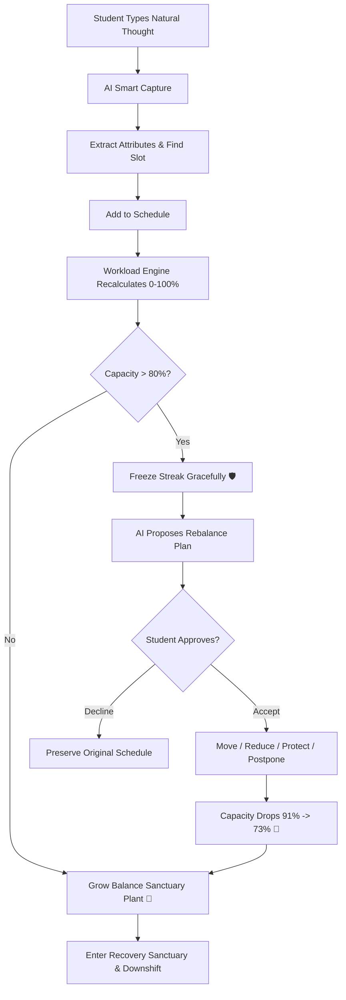

# Lumora — UI/UX Design System & Specification

## 1. Design System & Low-Stress Aesthetics

Lumora adheres to a **calming, non-punitive visual philosophy**. The user interface communicates safety and self-preservation rather than pressure.

```
       SOFT SAGE              CALM MINT              WARM SAND              MUTED ROSE
        #88A788                #E8EFE8                #C89B6D                #C86D6D
    (Primary Accent)       (Surface / Badges)     (Elevated Load)         (Peak Alert)

       WARM IVORY             SERENE SLATE           BORDER STROKE
        #FFFFF7                #354546                #E5EAE3
    (Page Canvas)          (Typography)           (Soft Dividers)
```

### Core Low-Stress UX Rules:
1. **The Rule of 3**: The dashboard overview displays only today's **top 3 tasks**. Secondary responsibilities are accessible under *"View All"* to prevent cognitive paralysis.
2. **Progress Over Deadlines**: Tasks feature completion bars (`80% done`) rather than screaming red countdown timers.
3. **Aggressive Whitespace**: Breathable card paddings (`p-6` to `p-8`) with soft geometry (`border-radius: 20px+`).
4. **Non-Clinical Language**: The system uses terms like *"Your load appears high"*, strictly avoiding medical diagnostics like *"You have burnout"*.

---

## 2. Page-by-Page Specifications

### 2.1 Dashboard Page (`/dashboard`)
- **Header**: Greeting (`Good day, Alex Chen 👋`), live combined capacity subtitle, and **`Smart Capture Task`** quick button.
- **Hero Capacity Card**:
  - Large numeric indicator (`68%`).
  - Explanation: *"of recommended weekly energy envelope"*.
  - Category load driver chips (`Academic Thesis`, `Part-Time Shift`).
  - Capacity envelope gauge with segmented status boundaries ($0\% \rightarrow 40\% \rightarrow 70\% \rightarrow 100\%$).
- **Anti-Streak & Balance Sanctuary Card**:
  - Living digital plant visual ($\text{Sprout} \rightarrow \text{Foliage} \rightarrow \text{Bonsai}$) with pulse aura.
  - Active Streak counter pill (`5 DAYS In Equilibrium`).
  - Graceful freeze indicator when overloaded (`Streak Gracefully Paused 🛡️`).
  - Restorative milestone chips and quick action: `[Enter Recovery Sanctuary →]`.
- **Life Area Grid**: 4 modular cards (`Academic`, `Mood & Stress`, `Physical & Sleep`, `Social & Errands`) displaying real-time metrics.
- **Mid-Section Grid**:
  - Left: **Today's Focus Timeline** (Rule of 3 items, complete checkbox, edit icon, and `Push to Tomorrow` button).
  - Right: **Load Breakdown Visualizer** (Color-coded progress bars showing relative category contributions).
- **Demo Controls Toolbar**: One-click evaluators for hackathon judges (`Simulate 91% Overload` and `Reset to Baseline`).

### 2.2 Recovery Sanctuary (`/recovery`)
- **Sanctuary Hero**:
  - Banner: *"YOU'VE DONE ENOUGH TODAY."*
  - Subtitle: *"Rest is not something you have to earn — it enables tomorrow."*
  - **Interactive Box Breathing Rhythm Widget**: Animated pulsating circle cycling every 12 seconds ($4\text{s Inhale} \cdot 4\text{s Hold} \cdot 4\text{s Exhale}$).
- **Active Restorative Timer**: 20-minute customizable countdown with Play, Pause, Reset, and **`Finish & Nurture Sanctuary 🌿`** (+25 Growth Points with confetti).
- **Prescribed Rest Opportunities**: Context-aware cards (e.g., *Screen-Free Reset*, *Sleep Wind-Down*, *Fresh Air Stroll*).

### 2.3 Life Area: Mood & Stress (`/mood`)
- **Interactive Check-In Panel**: Sliders for *Perceived Stress* (1–5), *Mood Level* (1–5), and *Cognitive Fatigue* (1–5) with optional reflection notes.
- **Weekly Stress & Bandwidth Trend Chart**: Dual-line Recharts graph mapping Stress Level (Warm Amber) vs. Mood Bandwidth (Sage Green) across 7 days.

### 2.4 What-If Decision Simulator (`/whatif`)
- **Natural Language Scenario Input**: Prompt box for student queries (e.g., *"Can I take another part-time shift on Saturday?"*).
- **Instant Decision Impact Visualizer**: Current load ($70\%$) vs. Unbalanced ($86\%$) comparison bar.
- **Trade-Off Cards**: Side-by-side comparison of Options A, B, and C with recommended badges.

---

## 3. User Flow Diagrams

### Complete Autonomous Product Loop

